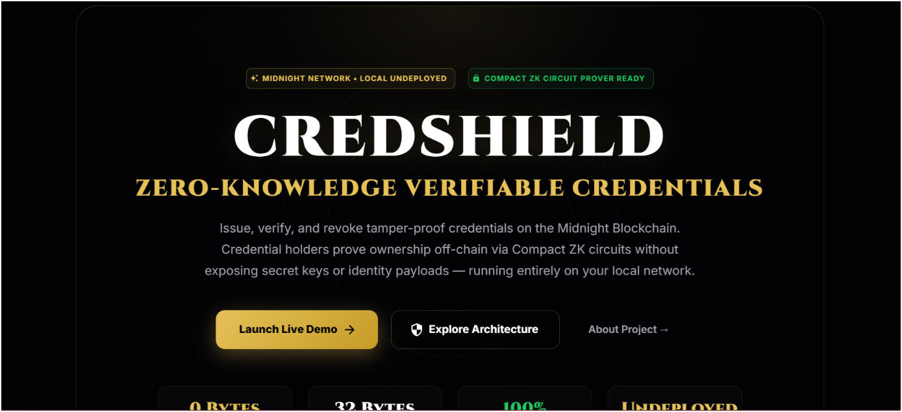
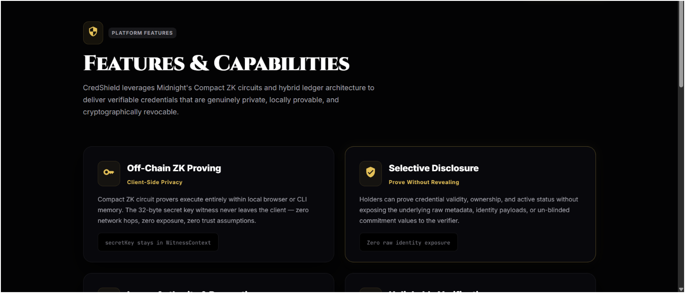
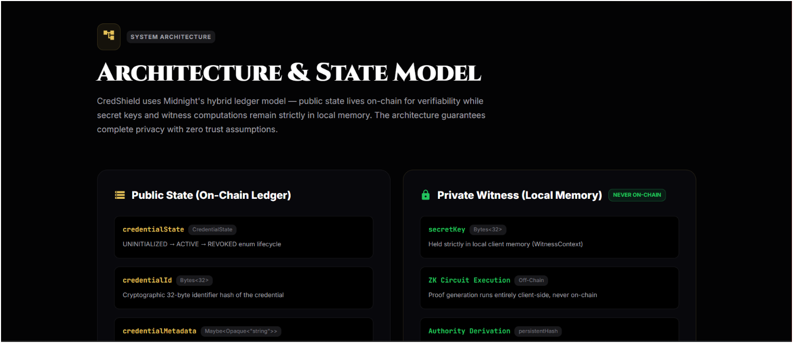
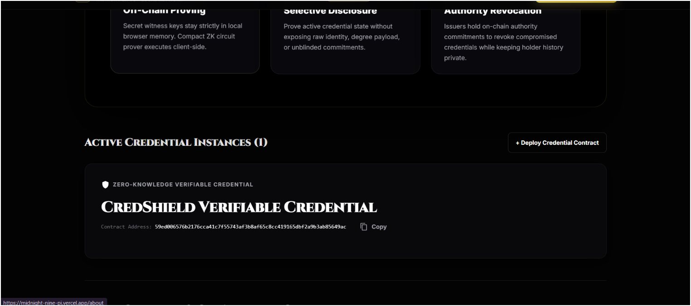

# CredShield — Privacy-Preserving Credential Verifier Platform



---

## 🌐 Live Demo & Links

| Resource | Link |
|----------|------|
| **Live Demo** | [https://midnight-nine-pi.vercel.app](https://midnight-nine-pi.vercel.app) |
| **Demo Video** | [Google Drive — Full Walkthrough](https://drive.google.com/drive/folders/1Vlo_kcGJ7q2RhJv3ElzxwsvL9vEdzgxU?usp=sharing) |
| **GitHub Repository** | [github.com/ArchishmanS2005/midnight](https://github.com/ArchishmanS2005/midnight) |
| **Deployed Contract (Preprod)** | `0200dbf964f541e1950883f5b2f539b66fd6111e46ce8e6e9551fbdd180114d5` |

---

## 💡 Product Vision

In traditional digital credential verification systems, verifying academic degrees, employment history, or professional certifications requires either exposing full personal identity payloads to third-party verifiers or relying on centralized verification APIs that track user activity. **CredShield** solves this by establishing a privacy-preserving credential verification protocol on the **Midnight Blockchain**.

CredShield allows certified institutions to issue tamper-proof verifiable credentials while enabling holders to prove credential validity, ownership, and active state off-chain via **Compact Zero-Knowledge (ZK) circuits** without publicly disclosing personal keys or identity data.

---

## 🔐 Privacy Claim

> **Observable Privacy Behavior**: When a credential holder executes `verifyCredential`, the ZK circuit proves they possess the correct `secretKey` by computing `authorityPublicKey(secretKey, sequence)` entirely within the local witness context. The proof is submitted on-chain and the `totalVerified` counter increments — but the **secret key value is never disclosed, transmitted, or stored on the ledger**. The verifier only sees the proof validity, not the underlying identity.

This demonstrates **selective disclosure**: proving credential ownership without revealing the holder's secret key or raw identity metadata.

---

## 🎬 Demo Video

> 📹 **[Watch the CredShield Demo Video →](https://drive.google.com/drive/folders/1Vlo_kcGJ7q2RhJv3ElzxwsvL9vEdzgxU?usp=sharing)**

*Demonstrates: Lace wallet connect/disconnect, credential issuance circuit call, ZK verification proof generation, and on-chain state update.*

---

## 🖼️ UI Screenshots

| Landing Page | Features Page |
|---|---|
|  |  |

| Architecture Page | Live Demo Page |
|---|---|
|  |  |

| About Page |
|---|
|  |

---

## ✅ Level 2 Submission Checklist

| Requirement | Status |
|-------------|--------|
| Lace wallet connect / disconnect implemented | ✅ DApp Connector API v4 (CAIP-372 UUID detection) |
| Circuit called successfully from frontend | ✅ `issueCredential`, `verifyCredential`, `revokeCredential` |
| Observable privacy behavior | ✅ Secret key proven in ZK without disclosure (see Privacy Claim above) |
| Contract deployed to Preprod with verifiable address | ✅ `0200dbf964f541e1950883f5b2f539b66fd6111e46ce8e6e9551fbdd180114d5` |
| Minimum 8 meaningful commits | ✅ 10+ commits with conventional commit messages |
| Public GitHub repository with README | ✅ [github.com/ArchishmanS2005/midnight](https://github.com/ArchishmanS2005/midnight) |
| Live demo link | ✅ [midnight-nine-pi.vercel.app](https://midnight-nine-pi.vercel.app) |
| Demo video: wallet connect + circuit call | ✅ [Google Drive](https://drive.google.com/drive/folders/1Vlo_kcGJ7q2RhJv3ElzxwsvL9vEdzgxU?usp=sharing) |

---

## 🚀 Quick Start — Local Development

### Prerequisites

- **Node.js** >= 24.11.1 (`nvm use 24`)
- **Docker** and Docker Compose v2
- **Compact Compiler** v0.5.1
- **Lace Wallet** browser extension (set to "Undeployed" network)

### Step 1: Start Local Midnight Network

```bash
docker compose -f standalone.yml up -d
```

| Service | Port | URL |
|---------|------|-----|
| Midnight Node | 9944 | `http://localhost:9944` |
| Indexer (GraphQL + WS) | 8088 | `http://localhost:8088/api/v4/graphql` |
| Proof Server | 6300 | `http://localhost:6300` |

### Step 2: Fund Wallet

```bash
npm install -g midnight-wallet-cli
midnight config set network undeployed
midnight wallet generate credshield
midnight airdrop 10000
midnight dust register   # ~5 min on fresh wallet
```

### Step 3: Compile & Build

```bash
cd contract && compact compile src/credshield.compact src/managed/credshield && yarn build
cd ../api && yarn build
cd ../credshield-ui && yarn dev --host
```

Open `http://localhost:5173` → Connect Lace (Undeployed network) → Issue & Verify.

---

## 🔒 Architecture: Public vs. Private State

```
┌─────────────────────────────────────────────────────────────────────────┐
│                          CredShield Architecture                        │
├────────────────────────────────────┬────────────────────────────────────┤
│         Public State (Ledger)      │       Private Witness (Local)      │
├────────────────────────────────────┼────────────────────────────────────┤
│ • credentialState (ACTIVE/REVOKED) │ • secretKey (Bytes<32> Local Key)  │
│ • credentialId (Bytes<32> Hash)    │ • Un-blinded Holder Identity       │
│ • issuerAuthority (Bytes<32> PK)   │ • ZK Witness Context & Nonces      │
│ • totalIssued (Counter)            │ • Off-Chain Proof Generation       │
│ • totalVerified (Counter)          │ • Private State Storage            │
└────────────────────────────────────┴────────────────────────────────────┘
```

---

## 🛠️ Compact Smart Contract (3 ZK Circuits)

```compact
pragma language_version 0.23;

export enum CredentialState { UNINITIALIZED, ACTIVE, REVOKED }

export ledger credentialState: CredentialState;
export ledger credentialId: Bytes<32>;
export ledger issuerAuthority: Bytes<32>;
export ledger totalIssued: Counter;
export ledger totalVerified: Counter;

witness secretKey(): Bytes<32>;

export circuit issueCredential(id: Bytes<32>, metadata: Opaque<"string">): [] {
  issuerAuthority = disclose(authorityPublicKey(secretKey(), sequence as Field as Bytes<32>));
  credentialId = disclose(id);
  credentialState = CredentialState.ACTIVE;
  totalIssued.increment(1);
}

export circuit verifyCredential(providedId: Bytes<32>): [] {
  assert(credentialState == CredentialState.ACTIVE, "Credential not active");
  assert(providedId == credentialId, "Credential ID mismatch");
  totalVerified.increment(1);
}

export circuit revokeCredential(): [] {
  assert(issuerAuthority == authorityPublicKey(secretKey(), sequence as Field as Bytes<32>));
  credentialState = CredentialState.REVOKED;
}
```

---

## 🌟 Key Features

- **Compact ZK Circuit Verification** — Off-chain proof generation, secret keys never leave local memory
- **Lace Wallet Integration** — DApp Connector API v4, CAIP-372 UUID-based wallet discovery
- **Local-First Development** — Full Midnight stack in Docker (node + indexer + proof server)
- **Issuer Authority & Revocation** — On-chain cryptographic revocation by issuer only
- **Selective Disclosure** — Prove credential validity without raw metadata exposure
- **GSAP Scroll Animations** — Premium animated UI with scroll-triggered reveals
- **Vercel Deployed** — Production frontend at [midnight-nine-pi.vercel.app](https://midnight-nine-pi.vercel.app)

---

## 📁 Monorepo Structure

```
credshield/
├── contract/              # Compact ZK smart contract & compiled circuits
├── api/                   # TypeScript API wrapper (CredShieldAPI)
├── credshield-cli/        # Interactive CLI (standalone/undeployed/preprod modes)
├── credshield-ui/         # React 19 + MUI 9 + GSAP + Vite 8 Web DApp
├── standalone.yml         # Docker Compose for local Midnight network
├── vercel.json            # Vercel deployment configuration
└── docs/screenshots/      # UI screenshots
```

---

## 📜 Commit History

Authored by **ArchishmanS2005** (`archishmansarkar94@gmail.com`)

---

## 🛡️ License

MIT License. Developed by **ArchishmanS2005** for the Midnight Rise In Level 2 Builder Challenge.
