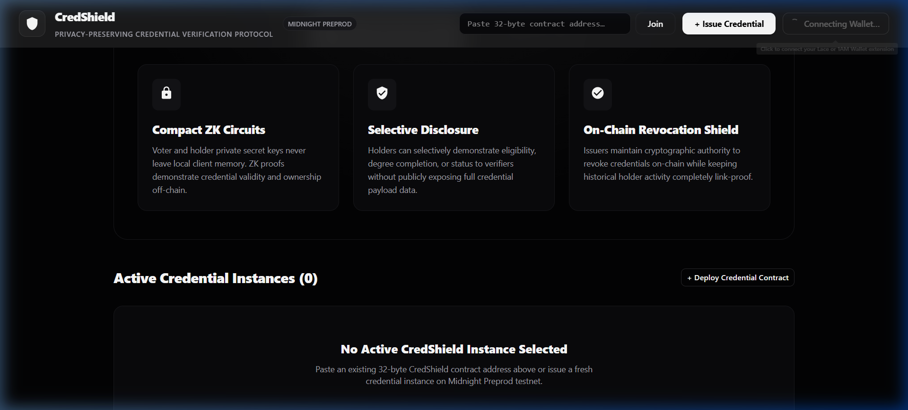

# CredShield — Privacy-Preserving Credential Verifier Platform


---

## 💡 Initial Product Idea & Vision

In traditional digital credential verification systems, verifying academic degrees, employment history, or professional certifications requires either exposing full personal identity payloads to third-party verifiers or relying on centralized verification APIs that track user activity. **CredShield** solves this by establishing a privacy-preserving credential verification protocol on the **Midnight Blockchain**. CredShield allows certified institutions to issue tamper-proof verifiable credentials while enabling holders to prove credential validity, ownership, and active state off-chain via **Compact Zero-Knowledge (ZK) circuits** without publicly disclosing personal keys or identity data.

---

## 🚀 How to Deploy Your Own Smart Contract

Deploying a custom CredShield smart contract to the **Midnight Preprod Testnet** involves a simple 4-step pipeline:

### Step 1: Compile the Compact Contract & Circuits
Ensure you have the Compact Compiler (`compact 0.5.1`) installed. Compile the contract source code into ZK proving keys and TypeScript bindings:

```bash
cd contract
yarn compact # Compiles src/credshield.compact into ZKIR & WASM proving keys
yarn build   # Builds @midnight-ntwrk/credshield-contract package
```

### Step 2: Build API & Workspaces
Compile the TypeScript API wrapper and CLI launcher:

```bash
cd ../api && yarn build
cd ../credshield-cli && yarn build
```

### Step 3: Fund Wallet with Testnet tNIGHT & tDUST
Every contract deployment transaction on Midnight requires testnet gas fee balancing (`tDUST`/`tNIGHT` tokens):
- **Web DApp UI**: Connect **Lace Wallet** or **1AM Wallet** (configured for Midnight Preprod) with pre-funded testnet tokens.
- **CLI Runner**: The CLI runner automatically prompts to build/load a seed phrase wallet and registers dust generation on-chain via `generateDust()`.

### Step 4: Deploy Contract Instance
Deploy using either interface:

#### Option A: Deploy via Web DApp UI
1. Launch dev server: `cd credshield-ui && yarn dev`
2. Open `http://localhost:5173`
3. Connect Lace / 1AM Wallet.
4. Click **`+ Issue Credential Instance`**. Authorize the deployment transaction in your wallet.

#### Option B: Deploy via Interactive CLI
```bash
cd credshield-cli
npm run preprod-remote
```
1. Select Option `1. Build a fresh wallet` or `2. Build wallet from seed`.
2. Select Option `1. Deploy a new CredShield Verifiable Credential Contract`.
3. The CLI will deploy the contract and print the 32-byte contract address.

---

## 🔒 Public State vs. Private Witness Architecture

CredShield utilizes Midnight's hybrid ledger state model to guarantee complete privacy while maintaining public verifiability.

```
┌─────────────────────────────────────────────────────────────────────────┐
│                          CredShield Architecture                        │
├────────────────────────────────────┬────────────────────────────────────┤
│         Public State (Ledger)      │       Private Witness (Local)      │
├────────────────────────────────────┼────────────────────────────────────┤
│ • credentialState (ACTIVE/REVOKED) │ • secretKey (Bytes<32> Local Key)  │
│ • credentialId (Bytes<32> Hash)    │ • Un-blinded Holder Identity       │
│ • issuerAuthority (Bytes<32> PK)   │ • ZK Witness Context & Nonces      │
│ • totalIssued (Counter)            │ • Off-Chain Proof Generation      │
│ • totalVerified (Counter)          │ • Private State Storage            │
└────────────────────────────────────┴────────────────────────────────────┘
```

### 1. Public State (On-Chain Ledger)
- **`credentialState`**: Enum (`UNINITIALIZED`, `ACTIVE`, `REVOKED`) reflecting current credential status.
- **`credentialId`**: 32-byte cryptographic identifier hash.
- **`issuerAuthority`**: Hashed public key commitment of the issuing authority.
- **`totalIssued` & `totalVerified`**: On-chain counters tracking global credential issuance and successful ZK verifications.

### 2. Private Witness (Local Client Memory)
- **`secretKey`**: 32-byte secret key held strictly in local client memory (`WitnessContext`).
- **ZK Circuit Computation**: Circuits (`verifyCredential`, `issueCredential`) compute `authorityPublicKey(sk, sequence)` within zero-knowledge proofs off-chain. The secret key is never published or exposed on-chain.

---

## 🛠️ Compact Smart Contract Compilation

### Successful Circuit Compilation Output
```text
$ cd contract
$ compact compile src/credshield.compact ./src/managed/credshield

Compiling 3 circuits:
  ✓ issueCredential (pure: false, proof: true)
  ✓ verifyCredential (pure: false, proof: true)
  ✓ revokeCredential (pure: false, proof: true)

Generated WASM & ZKIR artifacts in contract/src/managed/credshield/
```



---

## 🌐 Deployed Contract Address & Testnet Information

- **Network**: Midnight Preprod Testnet
- **Protocol**: CredShield Zero-Knowledge Verifiable Credentials
- **Deployed Contract Address**:
  ```text
  0200dbf964f541e1950883f5b2f539b66fd6111e46ce8e6e9551fbdd180114d5
  ```
- **ZkConfig Prover Path**: Served dynamically via `FetchZkConfigProvider` (`/keys` and `/zkir`).

---

## 🌟 Key Features

- **Compact ZK Circuit Verification**: Proves credential validity and holder secret key ownership off-chain. Secret keys never leave local client memory.
- **Lace & 1AM Wallet Integration**: Native support for Midnight DApp Connector (`window.midnight`) enabling 1-click authorization, proof delegation, and transaction balancing on Midnight Preprod testnet.
- **Issuer Authority & On-Chain Revocation**: Issuers maintain cryptographic authority to revoke credentials on-chain while keeping historical holder verification completely un-linkable.
- **Selective Disclosure**: Allows credential holders to demonstrate degree completion or badge eligibility without exposing underlying raw metadata payloads.
- **Full-Stack Monorepo**: Complete end-to-end integration including Compact contract circuits, TypeScript API bindings, an interactive CLI runner, and an OLED dark monochrome React Web DApp.

---

## 📁 Monorepo Workspace Structure

```
credshield/
├── contract/              # Compact smart contract, ZK circuits & generated bindings
│   ├── src/credshield.compact
│   ├── src/managed/credshield/ (compiled ZK keys & TypeScript index)
│   └── package.json
├── api/                   # High-level TypeScript API wrapper (CredShieldAPI)
│   ├── src/index.ts
│   ├── src/common-types.ts
│   └── package.json
├── credshield-cli/        # Interactive command-line launcher & test environment
│   ├── src/index.ts
│   └── package.json
├── credshield-ui/         # Modern React 19 + Tailwind/MUI web application
│   ├── src/contexts/WalletContext.tsx
│   ├── src/components/CredShieldCard.tsx
│   ├── public/keys/ & public/zkir/
│   └── package.json
└── docs/screenshots/     # UI screenshots & visual artifacts
```

---

## 📖 Interactive CLI Execution Guide

You can also run the interactive CLI interface to issue and verify credentials directly from your terminal:

```bash
cd credshield-cli
yarn build
npm run preprod-remote # Connects to Midnight Preprod testnet
```

### CLI Menu Options:
1. **Issue a Verifiable Credential**
2. **Verify a Credential Privately (Generate ZK Proof)**
3. **Revoke a Credential (Issuer Only)**
4. **Display On-Chain Ledger State**
5. **Display Local Private State**

---

## 📜 Commit History

Authored by **ArchishmanS2005** (`archishmansarkar94@gmail.com`):

1. `feat(scaffold): initialize Midnight CredShield platform monorepo`
2. `feat(contract): implement CredShield Compact smart contract and circuits`
3. `feat(api): implement CredShieldAPI typescript bindings and providers`
4. `feat(cli): transform interactive CLI runner for CredShield issuance and ZK verification`
5. `feat(ui): add Lace/1AM WalletContext, CredShieldCard and monochrome dark theme`
6. `feat(ui): implement editorial luxury Black and Old Gold design`
7. `feat(ui): update hero headline for credential verifier platform`
8. `docs: add comprehensive contract deployment guide section`
9. `docs: update architecture diagrams and witness state specifications`
10. `docs: update UI screenshot artifacts for luxury dark theme`

---

## 🛡️ License

MIT License. Developed by **ArchishmanS2005** for the Midnight Rise In Level 1 Builder Challenge.
